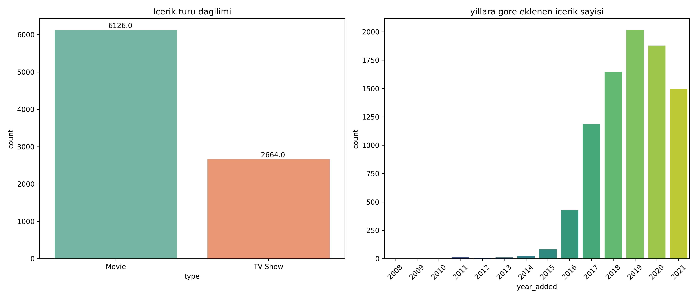
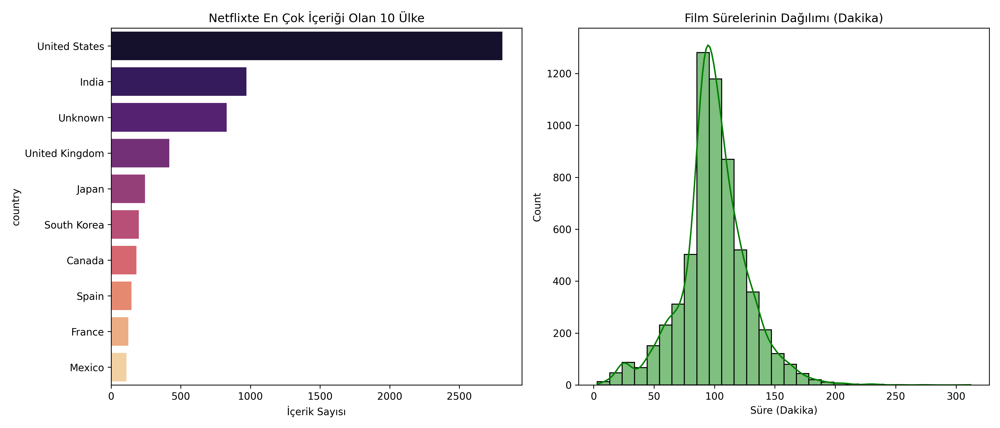

# 🎬 Netflix İçerik Stratejisi ve Veri Analizi Projesi

  

## 📌 Proje Hakkında
Bu proje, dünyanın en büyük dijital içerik platformu Netflix'in veri setini analiz ederek içerik stratejisini, büyüme trendlerini ve global odak noktalarını ortaya çıkarmayı amaçlar. 

Veri temizleme (Data Cleaning), özellik çıkarımı (Feature Engineering) ve görselleştirme (Visualization) teknikleri kullanılarak ham veriden anlamlı iş içgörüleri (Business Insights) elde edilmiştir.

## 📊 Kullanılan Veri Seti
Kaggle üzerinden temin edilen **Netflix Movies and TV Shows** veri seti kullanılmıştır.
* **Veri Sayısı:** 8807 satır, 12 sütun.
* **İçerik:** Film/Dizi adı, Yönetmen, Oyuncular, Ülke, Eklenme Tarihi, Süre vb.

## 🛠 Kullanılan Teknolojiler
* **Python:** Projenin ana dili.
* **Pandas:** Veri manipülasyonu, eksik veri doldurma ve zaman serisi işlemleri.
* **Seaborn & Matplotlib:** Veri görselleştirme ve istatistiksel grafikler.
* **NumPy:** Sayısal hesaplamalar.

## 💡 Önemli Çıkarımlar (Key Insights)

Yaptığım analizler sonucunda şu stratejik sonuçlara ulaştım:

1.  **İçerik Dominasyonu:** Netflix kütüphanesinin **%70'i Filmlerden** oluşmaktadır. Ancak 2018 sonrası Dizi (TV Show) yatırımlarında ciddi bir ivme görülmüştür.
2.  **Global Strateji:** İçerik üretiminde **ABD** lider olsa da, **Hindistan** en büyük ikinci içerik üreticisi olarak öne çıkmaktadır. Bu da Netflix'in Asya pazarına verdiği önemi gösterir.
3.  **Süre Analizi:** Filmlerin büyük çoğunluğu **90-100 dakika** bandında yoğunlaşmıştır. 
4.  **Büyüme Hızı:** Platforma eklenen içerik sayısı 2016 yılından itibaren eksponansiyel bir artış göstermiş, 2019 yılında zirveye ulaşmıştır.

## 📈 Görselleştirmeler

### 1. İçerik Türü Dağılımı ve Yıllara Göre Büyüme

### 2. Ülke Bazlı İçerik Dağılımı

